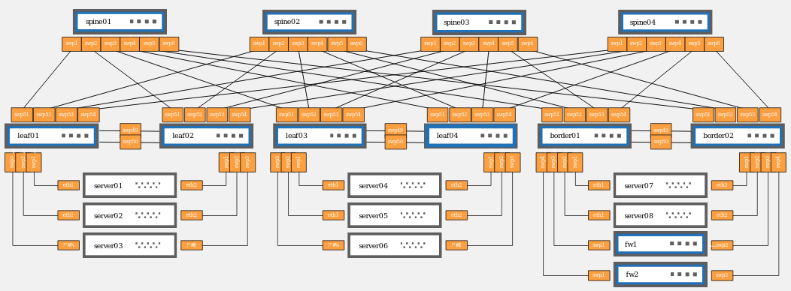

## Overview
Smart network repository based on Neo4j graph database.

## Instructions

The following instructions have been tested on Ubuntu (16.04, 18.04, 20.04), and Windows.

### Prerequisites

- Docker (19.03)
- Docker-compose (1.26 or 1.27)
- Git Bash (for Windows)

### Build/Run
Open a terminal and issue the following commands:

```bash
git clone https://github.com/amar-ox/smart-network-repository.git
cd smart-network-repository/docker
chmod +x build.sh run.sh
./build.sh
./run.sh
```

## Use The Smart Repository
When the Smart Repository starts, it automatically loads an example network and creates the database in Neo4j.

The example network is a [spine-leaf topology](https://docs.nvidia.com/networking-ethernet-software/nvidia-air/Pre-Built-Demos/) with 4 leaves, 4 spines, and 8 servers each connected on a different VLAN. The topology includes 2 border routers and 2 firewalls. The routing is realized with BGP.


*Image Source: [NVIDIA Corporation](https://docs.nvidia.com/networking-ethernet-software/nvidia-air/Pre-Built-Demos/)*

Examples of "what-if" scenarios are available in the `examples/` folder.

## Contribute

Contributions and feedback are welcome!